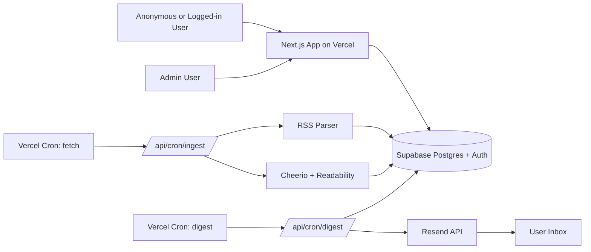

# DevFeed — Engineering Plan

> **Note:** This is the in-tree snapshot of the canonical Cursor plan kept at `~/.cursor/plans/eng-blog-aggregator_*.plan.md`. Both files should stay in sync. When you update one, mirror the change in the other.

## Overview

A free, single-region engineering blog aggregator built with Next.js 15 + Supabase + Vercel. Unified publisher model (companies and individual creators). Anonymous browsing, Email/Google login, user-suggested publishers with admin moderation, RSS-first ingestion with HTML scraping fallback, filtering by publisher type / company / tag / paid-or-free, bookmarks, and daily/weekly email digests via Resend.

## Todos

- [ ] **scaffold** — Scaffold Next.js 15 + TS app with Tailwind v4, shadcn/ui, ESLint/Prettier, and base layout
- [ ] **supabase-setup** — Initialize Supabase project locally, write `0001_init.sql` migration (unified publishers + sources + posts + suggestions + RLS)
- [ ] **auth** — Wire Supabase Auth (Email magic link + Google OAuth), profiles trigger, login/logout UI, requireUser/requireAdmin helpers
- [ ] **onboarding** — Build 3-step onboarding (pick publishers, pick tags, pick digest frequency)
- [ ] **public-feed** — Build public feed page, publisher detail page (handles company/person variants), tag pages, filter sidebar (incl. publisher-type and free/paid filters), search, outbound redirect with read-event logging
- [ ] **ingestion** — Implement RSS parser + Cheerio/Readability scraping fallback, URL canonicalization, auto-tagger, paid-status detector, `/api/cron/ingest` route with `CRON_SECRET`
- [ ] **suggest-flow** — Build `/suggest` page (unified form for company/person) and `/admin/moderation` queue with approve / reject / request-changes actions and submitter notification emails
- [ ] **admin** — Build admin pages: publishers CRUD (typed), blog_sources CRUD, tags CRUD, users page, with role-gated middleware
- [ ] **user-account** — Build `/me`: digest prefs, follow publishers/tags, bookmarks list (grouped, bulk actions), timezone, my-suggestions tab
- [ ] **digests** — Implement react-email digest template, `/api/cron/digest` route with daily+weekly schedules, unsubscribe handling, suggestion-status emails
- [ ] **analytics** — Create SQL views for trending/top posts, build `/admin/analytics` dashboard with recharts (incl. breakdowns by publisher type and paid/free)
- [ ] **seed** — Write seed script to import the 40 starter company blogs (as publishers type=company) with auto-discovered RSS feeds; include 5 starter person samples
- [ ] **security** — Add zod validation, SSRF guard on feed fetches, structured JSON logger with redaction, rate limiting on writes and on suggestion submissions
- [ ] **deploy** — Configure Vercel project, environment variables, Cron jobs, Supabase production project, Resend domain, and document the domain purchase step

---

## 1. Tech stack & hosting (all free tier)

- **Framework**: Next.js 15 (App Router, Server Components, Server Actions, Route Handlers) + TypeScript
- **UI**: Tailwind CSS v4 + shadcn/ui + lucide-react + `recharts` (admin charts)
- **DB + Auth**: Supabase (Postgres + Auth with Email magic link + Google OAuth + Row Level Security)
- **Hosting**: Vercel Hobby (Next.js app + 2 cron jobs)
- **Cron**: Vercel Cron for ingestion + digests; Supabase `pg_cron` as backup for >2 jobs
- **Email**: Resend (3,000 emails/month, 100/day) with `react-email` templates
- **Ingestion libs**: `rss-parser` (RSS/Atom), `cheerio` + `@mozilla/readability` + `jsdom` (scraping fallback), `p-limit` (concurrency)
- **Analytics**: First-party event table in Postgres (no third-party tracker needed); optional PostHog free tier later
- **Validation**: `zod` + Server Actions

### Cost estimate (annual)

- Vercel Hobby: $0 (100 GB bandwidth, 100 GB-hours functions, 2 crons)
- Supabase Free: $0 (500 MB DB, 50k MAU, 5 GB egress)
- Resend Free: $0 (3k emails/mo, 100/day)
- Google OAuth: $0
- **Domain (only paid item)**: ~$10–12/yr `.com` or ~₹600–900/yr `.in`
- Total: **~$10–15/year** if you want a custom domain; **$0** on `*.vercel.app`.

### Domain name candidates

(verify availability on Cloudflare Registrar / Namecheap)

- `engiblogs.in` / `engiblogs.com`
- `enginerd.in` / `enginerd.com`
- `techfeeds.in`
- `devradar.in`
- `blogfront.in`
- `engfeeds.com`
- `theenghub.in`
- `devfeed.in` / `devfeed.com` (the working name)

## 2. High-level architecture



## 3. Database schema (Supabase Postgres, with RLS)

Defined in `supabase/migrations/0001_init.sql`. Uses a **unified `publishers` table** with a `type` enum so a company and an individual creator share the same follow / digest / search pipeline. Type-specific fields are kept nullable on the same row (cleaner than table inheritance for our scale).

Enums:

- `publisher_type`: `'company' | 'person'`
- `access_label`: `'free' | 'paid' | 'members_only' | 'mixed'`
- `paywall_provider`: `'substack' | 'ghost' | 'medium' | 'patreon' | 'wordpress' | 'other'`
- `suggestion_status`: `'pending' | 'approved' | 'rejected' | 'changes_requested'`

Tables:

- `publishers(id uuid pk, type publisher_type not null, name, slug unique, avatar_url, website, description, location, twitter_handle, github_handle, default_access_label access_label default 'free', claimed_by_user_id uuid nullable -> auth.users, claim_verified_at, created_at)`
  - For `type='company'`: `name` is brand, `avatar_url` is logo. Social handles optional (org accounts).
  - For `type='person'`: `name` is the person's display name, `avatar_url` is their photo, social handles populated.
- `blog_sources(id, publisher_id fk, feed_url, site_url, kind enum['rss','atom','scrape'], scrape_config jsonb, is_active bool, last_fetched_at, fetch_error_count int)`
- `tags(id, name, slug unique, color text default '#6366F1', created_at)`
- `posts(id, source_id fk, publisher_id fk, title, url unique, canonical_url unique, summary, author, published_at, reading_time_minutes int, access_label access_label default 'free', paywall_provider paywall_provider nullable, created_at)` — indexes: `(publisher_id, published_at desc)`, `(access_label, published_at desc)`, GIN full-text on `title || ' ' || summary`.
- `post_tags(post_id, tag_id, primary key)`
- `profiles(user_id pk -> auth.users, display_name, avatar_url, role enum['user','admin'] default 'user', timezone text default 'UTC', onboarded_at, created_at)`
- `user_followed_publishers(user_id, publisher_id, created_at, primary key)`
- `user_followed_tags(user_id, tag_id, created_at, primary key)`
- `bookmarks(user_id, post_id, created_at, primary key)`
- `digest_preferences(user_id pk, frequency enum['none','daily','weekly'] default 'none', day_of_week int, hour_of_day int default 8, only_followed_publishers bool default true, only_followed_tags bool default false, include_paid_posts bool default true, last_sent_at)`
- `publisher_suggestions(id, suggested_by_user_id, type publisher_type, name, website, feed_url nullable, suggested_tags text[], justification text, status suggestion_status default 'pending', auto_validation jsonb, reviewed_by_user_id nullable, reviewed_at, review_notes text, created_publisher_id nullable -> publishers, created_at)` — `auto_validation` stores the result of background checks (feed reachable, RSS valid, items found, latest post age) so the admin sees them in the queue.
- `read_events(id bigserial, post_id fk, user_id nullable, anonymous_id text, referrer text, ip_hash text, ua_hash text, created_at)` — partition or prune monthly to stay under 500 MB. **Hash IPs/UAs with a daily-rotating salt; no raw IP or PII stored** (see `logging-security` workspace rule).
- `digest_log(id, user_id, sent_at, post_count, status, error)`
- `audit_log(id, actor_user_id, action text, target_type text, target_id uuid, metadata jsonb, created_at)` — every admin write goes here. Surfaced on `/admin/overview`.

RLS rules:

- Read-only public on `publishers`, `blog_sources` (where `is_active`), `posts`, `tags`, `post_tags`.
- Owner-only on user-scoped tables (`user_followed_*`, `bookmarks`, `digest_preferences`, `publisher_suggestions` for the submitter to see their own).
- Admin bypass via `profiles.role = 'admin'` policy on every table.
- `audit_log` write-only via service role; readable by admins.

## 4. Repo layout

```
app/
  (public)/
    page.tsx                       # home feed, with filter sidebar
    publishers/[slug]/page.tsx     # detail page; renders company/person variants
    tags/[slug]/page.tsx
    search/page.tsx                # /search?q=...
    suggest/page.tsx               # unified "Suggest a publisher" form
    out/[postId]/route.ts          # redirect + logs read_event
  (auth)/login/page.tsx
  (account)/
    me/page.tsx                    # /me hub redirects to /me/digest
    me/digest/page.tsx
    me/followed-publishers/page.tsx
    me/followed-tags/page.tsx
    me/bookmarks/page.tsx
    me/notifications/page.tsx
    me/account/page.tsx
    me/suggestions/page.tsx        # status of the user's own suggestions
  (admin)/admin/
    overview/page.tsx              # KPIs + audit log + analytics
    sources/page.tsx               # CRUD blog_sources
    publishers/page.tsx            # CRUD publishers (filterable by type)
    tags/page.tsx
    users/page.tsx                 # users list + role + ban
    moderation/page.tsx            # publisher_suggestions queue
    analytics/page.tsx             # detail charts
    settings/page.tsx
  api/cron/
    ingest/route.ts                # secured by CRON_SECRET
    digest/route.ts                # secured by CRON_SECRET
    suggestion-validate/route.ts   # background validation worker
  not-found.tsx
  error.tsx                        # 500 boundary
  offline.tsx                      # service-worker fallback
lib/
  supabase/{server,client,admin}.ts
  ingest/{rss.ts,scrape.ts,canonicalize.ts,autoTag.ts,detectAccess.ts}
  email/{digest.tsx,suggestion-status.tsx,resend.ts}
  auth/{requireUser.ts,requireAdmin.ts}
  publisher/{badges.ts,formatName.ts}   # variant rendering helpers
  log.ts
components/
  ui/...                                # shadcn primitives
  publisher/{PublisherCard.tsx,PublisherHeader.tsx,AccessBadge.tsx}
  post/{PostCard.tsx,PostDetailModal.tsx}
  filters/{PublisherTypeFilter.tsx,AccessFilter.tsx,TagFilter.tsx}
supabase/migrations/...
seed/{publishers.ts,tags.ts}
```

## 5. Key flows

### Ingestion (`app/api/cron/ingest/route.ts`, every 4h)

1. Verify `Authorization: Bearer ${CRON_SECRET}`.
2. Load all `blog_sources` where `is_active` and `last_fetched_at < now() - 1h`.
3. With `p-limit(8)`:
   - If `kind in ('rss','atom')`: `rss-parser` → array of items.
   - Else (`scrape`): fetch HTML → `cheerio` to find article links via `scrape_config.selector` → fetch each → `Readability` for title/summary/published date.
4. Canonicalize URL (lowercase host, strip `utm_*`, `gclid`, hash). Dedupe via unique `canonical_url`.
5. Auto-tag: match title+summary against a curated keyword→tag dictionary.
6. Insert new `posts` + `post_tags`. Update `last_fetched_at`. Log structured JSON.

### Filtering UI

- URL-driven filters: `?type=company,person&publisher=stripe,dhh&tag=react,distributed-systems&access=free,paid&q=...&from=...&sort=newest|trending`
- "Trending" = `read_events` count in last 7 days (materialized view refreshed hourly).
- Publisher-type filter is rendered as a 2-pill segmented control; access-label filter is a 2-pill toggle.

### Suggestion + moderation flow

1. User opens `/suggest` (auth required). Picks Type, enters name + website. RSS auto-discovery in the background.
2. Submit: insert `publisher_suggestions(status='pending')`, enqueue `auto_validation`.
3. Admin opens `/admin/moderation`. Approve & add (Postgres txn creates `publishers` + `blog_sources` + sets suggestion approved + emails submitter), Reject (with notes), or Request changes.
4. Rate limiting: max 3 pending per user, max 10/week.

### Auth & roles

- Supabase Auth: Email magic link + Google OAuth.
- First sign-in trigger inserts a `profiles` row.
- First admin promoted via SQL: `update profiles set role='admin' where user_id = '<uuid>';`

### Email digests (`/api/cron/digest`)

- Two crons: daily 13:00 UTC, weekly Mon 13:00 UTC.
- Render `lib/email/digest.tsx` (`react-email`), send via Resend.
- Throttle to <100/day if user count exceeds 100.

### Admin analytics

- Posts ingested per day (30d), stacked by publisher type (company / person).
- Top 10 read posts (7d / 30d) with access-label badges.
- Reads per publisher (bar chart, with type icon).
- Reads split by access label over time.
- DAU / WAU.
- Source health.
- Suggestion funnel.

## 6. Security & privacy

- All secrets in **Vercel env vars** — never committed.
- Service-role Supabase client only in server-side ingestion/digest routes; UI uses anon client + RLS.
- Read-event tracking: hash IP and UA with a **daily-rotating salt**.
- Structured JSON logs with token redaction; correlation ID per request.
- Validate every user input with `zod`; SSRF guard on feed fetches (allow only `http(s)://`, block private IPs).
- Rate-limit `/out/[postId]` and admin write endpoints.
- Supabase Postgres connections forced TLS; RLS on every table.

## 7. Seed data

`seed/publishers.ts` seeds two groups so the unified model is exercised from day one:

- **Companies (40)**: parses the starter list (Airbnb → Zynga) into `publishers(type='company')` + `blog_sources` rows.
- **People (5 examples)**: Dan Abramov, DHH, Julia Evans, Charity Majors, Patrick McKenzie.

`seed/tags.ts` seeds the keyword→tag dictionary (~80 tags).

## 8. Out of scope for v1

- Full-text article storage / on-site reading mode.
- Platform-level paid features (Stripe). v1 is fully free; paid posts are label-only.
- Publisher claim / verification flow (column exists; UI deferred).
- Comments, upvotes, social sharing.
- Mobile app / PWA push notifications.
- Multi-language tagging, per-user ML recommendations.
- Paid-post free-preview extraction.
