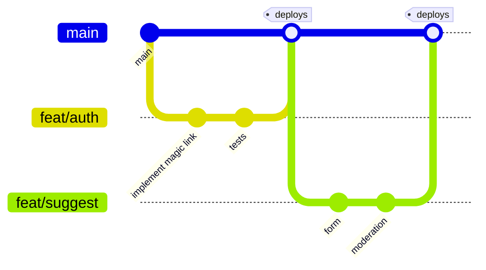
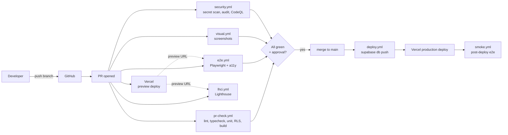

# CI / CD Pipeline

> Branching, GitHub Actions workflows, deployment to Vercel + Supabase, secret management, and quality gates. **All YAML below is ready to copy into `.github/workflows/` once we exit plan mode.** Companion to [`TESTING.md`](TESTING.md) and [`EXECUTION-PLAN.md`](EXECUTION-PLAN.md).

## Branching strategy

- `main` — production. Always deployable. Protected: 1 approval, all required CI green, signed commits, no force push.
- `feat/*`, `fix/*`, `chore/*`, `docs/*` — short-lived feature branches. Squash-merge into `main`.
- No `develop` branch. We deploy `main` continuously to a Vercel production environment; preview deployments per PR.



## CI/CD overview



## Required environment variables

All set in **GitHub Actions secrets** (`Settings → Secrets and variables → Actions`) AND in **Vercel project env vars** (Production / Preview / Development).

| Var                              | Source           | Used by                   | Notes                                          |
| -------------------------------- | ---------------- | ------------------------- | ---------------------------------------------- |
| `SUPABASE_URL`                   | Supabase project | runtime + CI              | public                                         |
| `SUPABASE_ANON_KEY`              | Supabase project | runtime + CI              | public                                         |
| `SUPABASE_SERVICE_ROLE_KEY`      | Supabase project | server-only routes + CI   | **secret**, never exposed to browser           |
| `SUPABASE_PROJECT_REF`           | Supabase project | CI (deploy migrations)    | secret                                         |
| `SUPABASE_DB_PASSWORD`           | Supabase project | CI (deploy migrations)    | secret                                         |
| `SUPABASE_ACCESS_TOKEN`          | Supabase account | CI (deploy migrations)    | secret                                         |
| `RESEND_API_KEY`                 | Resend           | runtime + CI              | secret                                         |
| `RESEND_FROM_EMAIL`              | Resend           | runtime                   | e.g. `digest@devfeed.com`                      |
| `CRON_SECRET`                    | generated        | runtime                   | secret, 64 random chars; rotate quarterly     |
| `DIGEST_UNSUB_JWT_SECRET`        | generated        | runtime                   | secret, separate from any other JWT secret    |
| `READ_EVENTS_HASH_SALT_BASE`     | generated        | runtime                   | secret, used to derive daily-rotating salt    |
| `GOOGLE_OAUTH_CLIENT_ID`         | Google Cloud     | Supabase Auth (not app)   | configured in Supabase dashboard              |
| `GOOGLE_OAUTH_CLIENT_SECRET`     | Google Cloud     | Supabase Auth             | configured in Supabase dashboard              |
| `GITHUB_OAUTH_CLIENT_ID`         | GitHub OAuth App | Supabase Auth             | configured in Supabase dashboard              |
| `GITHUB_OAUTH_CLIENT_SECRET`     | GitHub OAuth App | Supabase Auth             | configured in Supabase dashboard              |
| `VERCEL_TOKEN`                   | Vercel account   | CI (smoke + LHCI)         | secret                                         |
| `VERCEL_ORG_ID`                  | Vercel project   | CI                        |                                                |
| `VERCEL_PROJECT_ID`              | Vercel project   | CI                        |                                                |

> Workspace `hardcoded-credentials-block` rule applies — none of these may ever appear in source.

## Workflow files

All YAML below goes into `.github/workflows/` (and one into `.github/`). Filenames noted.

### 1. `pr-check.yml` — every PR's gate

```yaml
name: PR Check

on:
  pull_request:
    branches: [main]

concurrency:
  group: pr-check-${{ github.event.pull_request.number }}
  cancel-in-progress: true

env:
  NODE_VERSION: '20'
  PNPM_VERSION: '9'

jobs:
  lint-typecheck-build:
    name: Lint + typecheck + build
    runs-on: ubuntu-latest
    timeout-minutes: 10
    steps:
      - uses: actions/checkout@v4
      - uses: pnpm/action-setup@v4
        with:
          version: ${{ env.PNPM_VERSION }}
      - uses: actions/setup-node@v4
        with:
          node-version: ${{ env.NODE_VERSION }}
          cache: 'pnpm'
      - run: pnpm install --frozen-lockfile
      - run: pnpm lint
      - run: pnpm typecheck
      - run: pnpm build
        env:
          SUPABASE_URL: ${{ secrets.SUPABASE_URL }}
          SUPABASE_ANON_KEY: ${{ secrets.SUPABASE_ANON_KEY }}

  unit:
    name: Unit + integration tests
    runs-on: ubuntu-latest
    timeout-minutes: 10
    steps:
      - uses: actions/checkout@v4
      - uses: pnpm/action-setup@v4
        with:
          version: ${{ env.PNPM_VERSION }}
      - uses: actions/setup-node@v4
        with:
          node-version: ${{ env.NODE_VERSION }}
          cache: 'pnpm'
      - run: pnpm install --frozen-lockfile
      - run: pnpm test:unit --coverage
      - uses: actions/upload-artifact@v4
        if: always()
        with:
          name: coverage
          path: coverage/

  rls:
    name: RLS pgTAP tests
    runs-on: ubuntu-latest
    timeout-minutes: 10
    steps:
      - uses: actions/checkout@v4
      - uses: supabase/setup-cli@v1
        with:
          version: latest
      - run: supabase start
      - run: supabase test db
      - run: supabase stop

  bundle-size:
    name: Bundle size
    runs-on: ubuntu-latest
    timeout-minutes: 10
    steps:
      - uses: actions/checkout@v4
      - uses: pnpm/action-setup@v4
        with:
          version: ${{ env.PNPM_VERSION }}
      - uses: actions/setup-node@v4
        with:
          node-version: ${{ env.NODE_VERSION }}
          cache: 'pnpm'
      - run: pnpm install --frozen-lockfile
      - uses: andresz1/size-limit-action@v1
        with:
          github_token: ${{ secrets.GITHUB_TOKEN }}
```

### 2. `e2e.yml` — Playwright e2e + a11y on the Vercel preview

```yaml
name: E2E + a11y

on:
  pull_request:
    branches: [main]
  workflow_dispatch:

concurrency:
  group: e2e-${{ github.event.pull_request.number || github.run_id }}
  cancel-in-progress: true

env:
  NODE_VERSION: '20'
  PNPM_VERSION: '9'

jobs:
  wait-for-vercel:
    name: Wait for Vercel preview
    runs-on: ubuntu-latest
    timeout-minutes: 10
    outputs:
      preview_url: ${{ steps.wait.outputs.url }}
    steps:
      - uses: patrickedqvist/wait-for-vercel-preview@v1.3.1
        id: wait
        with:
          token: ${{ secrets.GITHUB_TOKEN }}
          max_timeout: 600

  e2e:
    name: Playwright (${{ matrix.browser }})
    needs: wait-for-vercel
    runs-on: ubuntu-latest
    timeout-minutes: 30
    strategy:
      fail-fast: false
      matrix:
        browser: [chromium, firefox, webkit]
    steps:
      - uses: actions/checkout@v4
      - uses: pnpm/action-setup@v4
        with:
          version: ${{ env.PNPM_VERSION }}
      - uses: actions/setup-node@v4
        with:
          node-version: ${{ env.NODE_VERSION }}
          cache: 'pnpm'
      - run: pnpm install --frozen-lockfile
      - run: pnpm exec playwright install --with-deps ${{ matrix.browser }}
      - run: pnpm test:e2e --project=${{ matrix.browser }}
        env:
          PLAYWRIGHT_BASE_URL: ${{ needs.wait-for-vercel.outputs.preview_url }}
          E2E_TEST_USER_EMAIL: ${{ secrets.E2E_TEST_USER_EMAIL }}
          E2E_TEST_USER_PASSWORD: ${{ secrets.E2E_TEST_USER_PASSWORD }}
      - uses: actions/upload-artifact@v4
        if: failure()
        with:
          name: playwright-report-${{ matrix.browser }}
          path: playwright-report/
          retention-days: 7

  a11y:
    name: Accessibility (axe)
    needs: wait-for-vercel
    runs-on: ubuntu-latest
    timeout-minutes: 15
    steps:
      - uses: actions/checkout@v4
      - uses: pnpm/action-setup@v4
        with:
          version: ${{ env.PNPM_VERSION }}
      - uses: actions/setup-node@v4
        with:
          node-version: ${{ env.NODE_VERSION }}
          cache: 'pnpm'
      - run: pnpm install --frozen-lockfile
      - run: pnpm exec playwright install --with-deps chromium
      - run: pnpm test:a11y
        env:
          PLAYWRIGHT_BASE_URL: ${{ needs.wait-for-vercel.outputs.preview_url }}
```

### 3. `visual.yml` — visual regression

```yaml
name: Visual regression

on:
  pull_request:
    branches: [main]

env:
  NODE_VERSION: '20'
  PNPM_VERSION: '9'

jobs:
  visual:
    runs-on: ubuntu-latest
    timeout-minutes: 20
    steps:
      - uses: actions/checkout@v4
      - uses: pnpm/action-setup@v4
        with:
          version: ${{ env.PNPM_VERSION }}
      - uses: actions/setup-node@v4
        with:
          node-version: ${{ env.NODE_VERSION }}
          cache: 'pnpm'
      - run: pnpm install --frozen-lockfile
      - run: pnpm exec playwright install --with-deps chromium
      - run: pnpm test:visual
      - uses: actions/upload-artifact@v4
        if: failure()
        with:
          name: visual-diffs
          path: |
            test-results/
            playwright-report/
          retention-days: 14
```

### 4. `lhci.yml` — Lighthouse CI (warning, not blocking)

```yaml
name: Lighthouse CI

on:
  pull_request:
    branches: [main]

jobs:
  lhci:
    runs-on: ubuntu-latest
    timeout-minutes: 10
    continue-on-error: true   # warning, not blocking
    steps:
      - uses: actions/checkout@v4
      - uses: patrickedqvist/wait-for-vercel-preview@v1.3.1
        id: wait
        with:
          token: ${{ secrets.GITHUB_TOKEN }}
          max_timeout: 600
      - uses: actions/setup-node@v4
        with:
          node-version: '20'
      - run: npm install -g @lhci/cli
      - run: |
          lhci autorun \
            --collect.url=${{ steps.wait.outputs.url }}/ \
            --collect.url=${{ steps.wait.outputs.url }}/publishers/netflix \
            --collect.url=${{ steps.wait.outputs.url }}/me/digest \
            --collect.url=${{ steps.wait.outputs.url }}/admin/overview \
            --assert.preset=lighthouse:recommended \
            --assert.assertions.categories:performance.minScore=0.9 \
            --assert.assertions.categories:accessibility.minScore=0.9
        env:
          LHCI_GITHUB_APP_TOKEN: ${{ secrets.LHCI_GITHUB_APP_TOKEN }}
```

### 5. `security.yml` — secret scan + npm audit + CodeQL

```yaml
name: Security

on:
  pull_request:
    branches: [main]
  schedule:
    - cron: '0 4 * * *'   # nightly 4 AM UTC
  workflow_dispatch:

permissions:
  contents: read
  security-events: write

jobs:
  secretlint:
    name: Secret scan
    runs-on: ubuntu-latest
    steps:
      - uses: actions/checkout@v4
      - uses: actions/setup-node@v4
        with:
          node-version: '20'
      - run: npx --yes secretlint "**/*"

  audit:
    name: npm audit (high+)
    runs-on: ubuntu-latest
    steps:
      - uses: actions/checkout@v4
      - uses: pnpm/action-setup@v4
        with: { version: '9' }
      - uses: actions/setup-node@v4
        with:
          node-version: '20'
          cache: 'pnpm'
      - run: pnpm install --frozen-lockfile
      - run: pnpm audit --prod --audit-level=high

  blocklist:
    name: Workspace dependency blocklist
    runs-on: ubuntu-latest
    steps:
      - uses: actions/checkout@v4
      - uses: pnpm/action-setup@v4
        with: { version: '9' }
      - uses: actions/setup-node@v4
        with: { node-version: '20', cache: 'pnpm' }
      - run: pnpm install --frozen-lockfile
      # Workspace rule: axios@1.14.1 and axios@0.30.4 must never appear (direct or transitive)
      - name: Check axios versions
        run: |
          if pnpm why axios 2>/dev/null | grep -E "axios@(1\.14\.1|0\.30\.4)"; then
            echo "::error::Blocklisted axios version detected. See workspace dependency-blocklist rule."
            exit 1
          fi

  codeql:
    name: CodeQL (JavaScript)
    runs-on: ubuntu-latest
    steps:
      - uses: actions/checkout@v4
      - uses: github/codeql-action/init@v3
        with:
          languages: javascript-typescript
      - uses: github/codeql-action/analyze@v3
```

### 6. `deploy.yml` — production deploy on merge to `main`

> Vercel auto-deploys `main` via its Git integration; this workflow handles only what Vercel can't: Supabase migrations and post-deploy smoke.

```yaml
name: Deploy

on:
  push:
    branches: [main]

concurrency:
  group: deploy-prod
  cancel-in-progress: false   # never cancel a deploy mid-flight

jobs:
  migrate:
    name: Run Supabase migrations
    runs-on: ubuntu-latest
    timeout-minutes: 10
    steps:
      - uses: actions/checkout@v4
      - uses: supabase/setup-cli@v1
        with:
          version: latest
      - run: supabase link --project-ref ${{ secrets.SUPABASE_PROJECT_REF }}
        env:
          SUPABASE_ACCESS_TOKEN: ${{ secrets.SUPABASE_ACCESS_TOKEN }}
          SUPABASE_DB_PASSWORD: ${{ secrets.SUPABASE_DB_PASSWORD }}
      - run: supabase db push --include-all
        env:
          SUPABASE_ACCESS_TOKEN: ${{ secrets.SUPABASE_ACCESS_TOKEN }}
          SUPABASE_DB_PASSWORD: ${{ secrets.SUPABASE_DB_PASSWORD }}

  smoke:
    name: Post-deploy smoke
    needs: migrate
    runs-on: ubuntu-latest
    timeout-minutes: 10
    steps:
      - uses: actions/checkout@v4
      - uses: pnpm/action-setup@v4
        with: { version: '9' }
      - uses: actions/setup-node@v4
        with: { node-version: '20', cache: 'pnpm' }
      - run: pnpm install --frozen-lockfile
      - run: pnpm exec playwright install --with-deps chromium
      - run: pnpm test:e2e --grep "@smoke" --project=chromium
        env:
          PLAYWRIGHT_BASE_URL: https://devfeed.com   # or *.vercel.app
      - if: failure()
        run: |
          echo "::error::Production smoke failed. Investigate immediately."
          # TODO: Slack webhook alert
```

### 7. `.github/dependabot.yml` — dependency updates

```yaml
version: 2
updates:
  - package-ecosystem: npm
    directory: /
    schedule:
      interval: weekly
      day: monday
      time: '04:00'
      timezone: Asia/Kolkata
    open-pull-requests-limit: 5
    versioning-strategy: increase
    groups:
      next:
        patterns: ['next', '@next/*', 'eslint-config-next']
      supabase:
        patterns: ['@supabase/*', 'supabase']
      testing:
        patterns:
          [
            'vitest',
            '@vitest/*',
            '@testing-library/*',
            '@playwright/test',
            'playwright',
            'msw',
            '@axe-core/*',
          ]
      shadcn:
        patterns: ['@radix-ui/*']
    ignore:
      # Workspace dependency-blocklist rule
      - dependency-name: 'axios'
        versions: ['1.14.1', '0.30.4']

  - package-ecosystem: github-actions
    directory: /
    schedule:
      interval: monthly
```

## Vercel configuration

`vercel.json` at repo root:

```json
{
  "$schema": "https://openapi.vercel.sh/vercel.json",
  "framework": "nextjs",
  "regions": ["bom1"],
  "crons": [
    {
      "path": "/api/cron/ingest",
      "schedule": "0 */4 * * *"
    },
    {
      "path": "/api/cron/digest",
      "schedule": "30 2 * * *"
    }
  ],
  "headers": [
    {
      "source": "/(.*)",
      "headers": [
        { "key": "X-Frame-Options", "value": "DENY" },
        { "key": "X-Content-Type-Options", "value": "nosniff" },
        { "key": "Referrer-Policy", "value": "strict-origin-when-cross-origin" },
        {
          "key": "Permissions-Policy",
          "value": "camera=(), microphone=(), geolocation=()"
        },
        {
          "key": "Strict-Transport-Security",
          "value": "max-age=63072000; includeSubDomains; preload"
        }
      ]
    }
  ]
}
```

## Branch protection (set in GitHub UI)

`main` requires:

- **1 approving review** (or self-review for solo work)
- **All status checks pass**:
  - `Lint + typecheck + build`
  - `Unit + integration tests`
  - `RLS pgTAP tests`
  - `Bundle size`
  - `Playwright (chromium)`, `Playwright (firefox)`, `Playwright (webkit)`
  - `Accessibility (axe)`
  - `Visual regression`
  - `Secret scan`
  - `npm audit (high+)`
  - `Workspace dependency blocklist`
  - `CodeQL (JavaScript)`
- **Conversation resolution required**
- **Linear history** (squash-merge only)
- **No force push, no deletion**
- **Restrict who can push** to admins only (or just Manoj for solo)

## Secret rotation runbook

Rotate quarterly OR immediately on any leak:

1. `CRON_SECRET` — generate new (`openssl rand -hex 32`), update in Vercel env, redeploy.
2. `DIGEST_UNSUB_JWT_SECRET` — generate new, update in Vercel; invalidates pending unsubscribe links (acceptable trade-off).
3. `READ_EVENTS_HASH_SALT_BASE` — generate new; old read_events become un-correlatable (intentional — privacy preserving).
4. Supabase service-role key — rotate via Supabase dashboard, update everywhere.
5. Resend API key — same.

Document every rotation in `docs/RUNBOOK-OPS.md` (date, who, why).

## What's NOT in CI (yet)

- **Mutation testing** (e.g. Stryker) — too slow for v1; revisit if test confidence becomes a problem.
- **Storybook + Chromatic** — for v1 we use Playwright visual regression directly. Add Storybook when the component library outgrows its current size.
- **Synthetic monitoring** (uptime checks) — use [BetterStack free tier](https://betterstack.com/) or Vercel's built-in analytics. Set up after Phase 12.
