# Mockup Gallery

> All 23 mockups embedded inline for preview. PNG files live in `./assets/` (relative to this file).
>
> **To view inline:** open this file in Cursor and use the Markdown Preview (`Cmd+Shift+V`).
>
> Mockups are AI-generated reference comps — they communicate layout, hierarchy, and design intent. Body text and avatars are placeholder; the implementation should match the structure and tokens, not the literal lorem-ipsum text rendered by the image model.

## Index

### Hero set (10) — primary screens

| #   | File                                       | What it shows                                       | Theme |
| --- | ------------------------------------------ | --------------------------------------------------- | ----- |
| 01  | `devfeed-01-home-light.png`                | Public home feed                                    | Light |
| 02  | `devfeed-02-home-dark.png`                 | Public home feed (theme parity)                     | Dark  |
| 03  | `devfeed-03-admin-analytics-light.png`     | Admin analytics dashboard                           | Light |
| 04  | `devfeed-04-company-page-light.png`        | Publisher detail (company variant)                  | Light |
| 05  | `devfeed-05-tag-page-dark.png`             | Tag detail with related-tags + top-publishers       | Dark  |
| 06  | `devfeed-06-login-both-themes.png`         | Login screen (light + dark side-by-side)            | Both  |
| 07  | `devfeed-07-user-dashboard-dark.png`       | `/me/digest` settings                               | Dark  |
| 08  | `devfeed-08-email-digest-preview.png`      | Email digest as rendered in Gmail-style inbox       | Light |
| 09  | `devfeed-09-admin-sources-dark.png`        | Admin sources CRUD with Add-source side drawer      | Dark  |
| 10  | `devfeed-10-admin-companies-light.png`     | Admin publishers grid with Add-publisher drawer     | Light |

### Secondary set (9) — flows, states, edge cases

| #   | File                                       | What it shows                                       | Theme |
| --- | ------------------------------------------ | --------------------------------------------------- | ----- |
| 11  | `devfeed-11-post-detail-modal-light.png`   | In-app post preview modal over dimmed feed          | Light |
| 12  | `devfeed-12-search-light.png`              | Typeahead + dedicated `/search` results page        | Light |
| 13  | `devfeed-13-bookmarks-dark.png`            | Bookmarks page with grouping + bulk-action toolbar  | Dark  |
| 14  | `devfeed-14-empty-states.png`              | 4-up empty states (light + dark variants)           | Both  |
| 15  | `devfeed-15-onboarding-light.png`          | 3-step onboarding flow (publishers / tags / digest) | Light |
| 16  | `devfeed-16-error-states.png`              | 404 / 500 / offline panels in app shell             | Light |
| 17  | `devfeed-17-loading-skeletons.png`         | Skeleton loading state (light + dark)               | Both  |
| 18  | `devfeed-18-admin-users-light.png`         | Admin users table with detail drawer                | Light |
| 19  | `devfeed-19-confirmation-modals.png`       | 3 destructive-action confirms (delete/pause/ban)    | Light |

### Publisher-unification set (4) — new model coverage

| #   | File                                       | What it shows                                       | Theme |
| --- | ------------------------------------------ | --------------------------------------------------- | ----- |
| 20  | `devfeed-20-suggest-publisher-light.png`   | Unified suggest form with Company/Person selector   | Light |
| 21  | `devfeed-21-admin-moderation-dark.png`     | Admin moderation queue with detail pane             | Dark  |
| 22  | `devfeed-22-publisher-person-light.png`    | Person publisher profile (`PublisherHeader` person) | Light |
| 24  | `devfeed-24-home-with-typefilter.png`      | Home feed with publisher-type filter active         | Light |

> **Note on #23:** A previous mockup of an "AI agent publisher profile" lived at `devfeed-23-publisher-aiagent-dark.png`. The AI agent publisher type was removed from the product scope on 2026-04-25 — the model now supports only `company` and `person`. Mockup #23 has been deleted from `assets/`. The remaining numbering (`20`, `21`, `22`, `24`) is left as-is to avoid renaming churn across docs and references.

---

## 01 — Home feed (light)

**Path:** `/`  ·  **Spec:** [`design/03-pages.md → /`](design/03-pages.md#---home-feed)

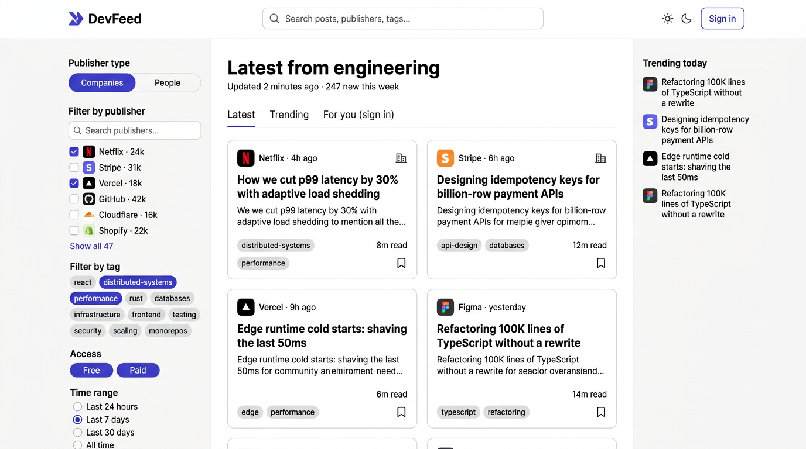

Filter sidebar (publisher-type segmented control with two pills — Companies / People — followed publishers checkbox list, tag chip cloud, access toggle, time range), tab bar, 2-column post grid. Establishes the primary `PostCard` pattern used everywhere — including the optional access badges (Free/Paid).

---

## 02 — Home feed (dark)

**Path:** `/`  ·  **Theme parity check vs #01**

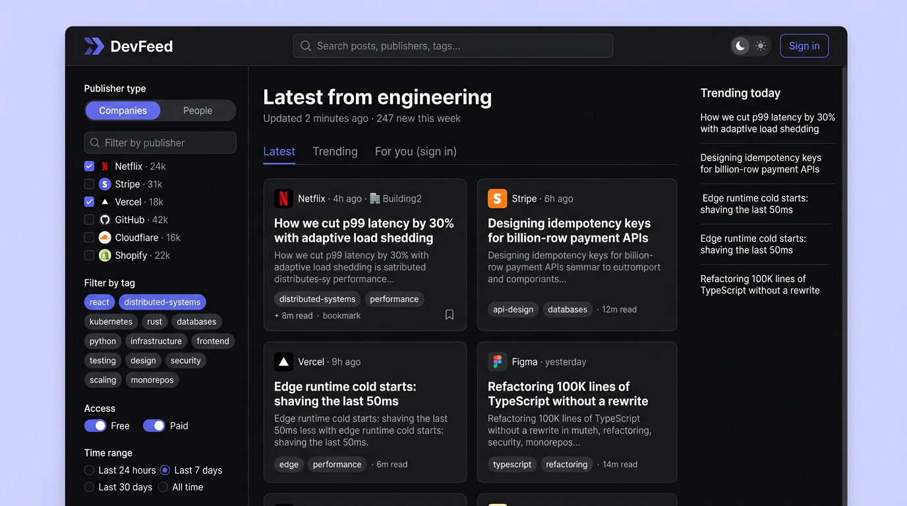

Same shell as #01 with dark theme tokens swapped. Confirms cards, chips, and meta text all hold up in dark mode.

---

## 03 — Admin analytics dashboard (light)

**Path:** `/admin/overview`  ·  **Spec:** [`design/03-pages.md → /admin/overview`](design/03-pages.md#adminoverview)

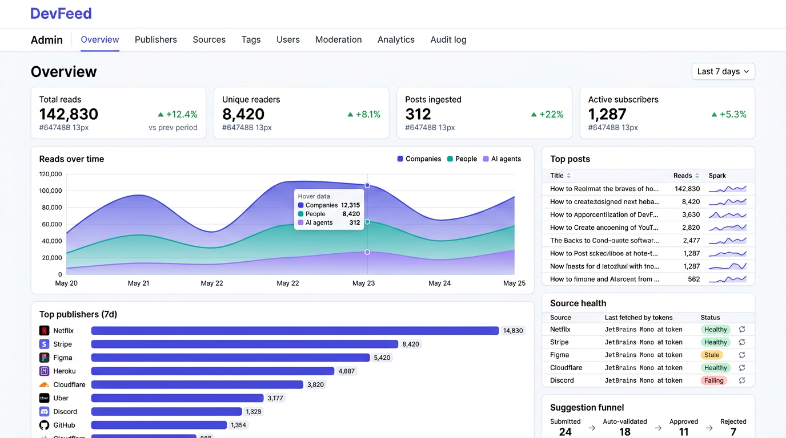

KPI strip → reads-over-time area chart (stacked by publisher type, only company / person now) → top-publishers bar → top-posts table with sparklines → source health → suggestion funnel. Establishes the admin sub-nav pattern used across `/admin/*`.

---

## 04 — Company publisher detail (light)

**Path:** `/publishers/netflix`  ·  **Spec:** [`design/03-pages.md → /publishers/[slug]`](design/03-pages.md#publishersslug--publisher-detail)

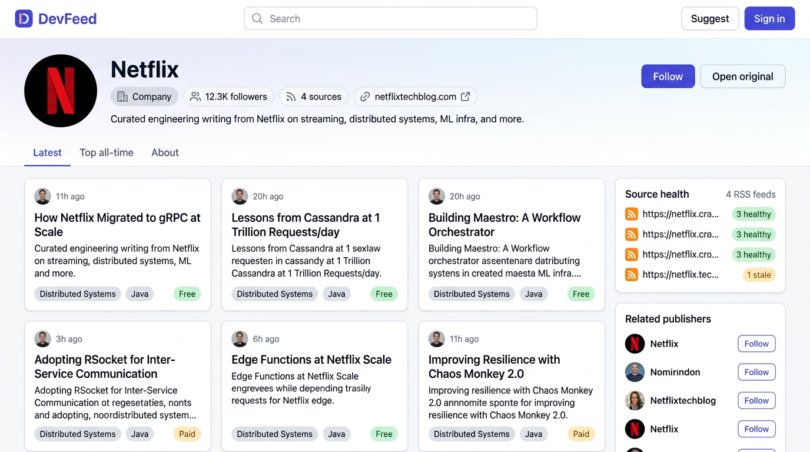

`PublisherHeader` company variant. Logo prominent, follow CTA, RSS health metadata strip, post grid below, related-publishers sidebar. Compare with #22 for the person variant.

---

## 05 — Tag detail (dark)

**Path:** `/tags/distributed-systems`  ·  **Spec:** [`design/03-pages.md → /tags/[slug]`](design/03-pages.md#tagsslug--tag-detail)

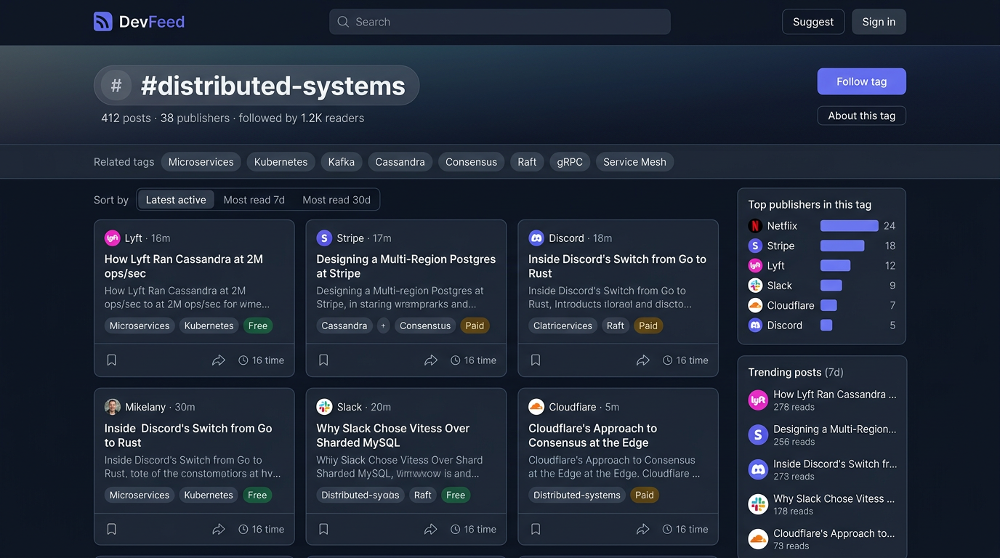

Tag header, related-tags chip strip, "Top publishers in this tag" sidebar with mini bar chart, sortable post list, trending-posts mini-list.

---

## 06 — Login (both themes)

**Path:** `/login`  ·  **Spec:** [`design/03-pages.md → /login`](design/03-pages.md#login--login--signup)

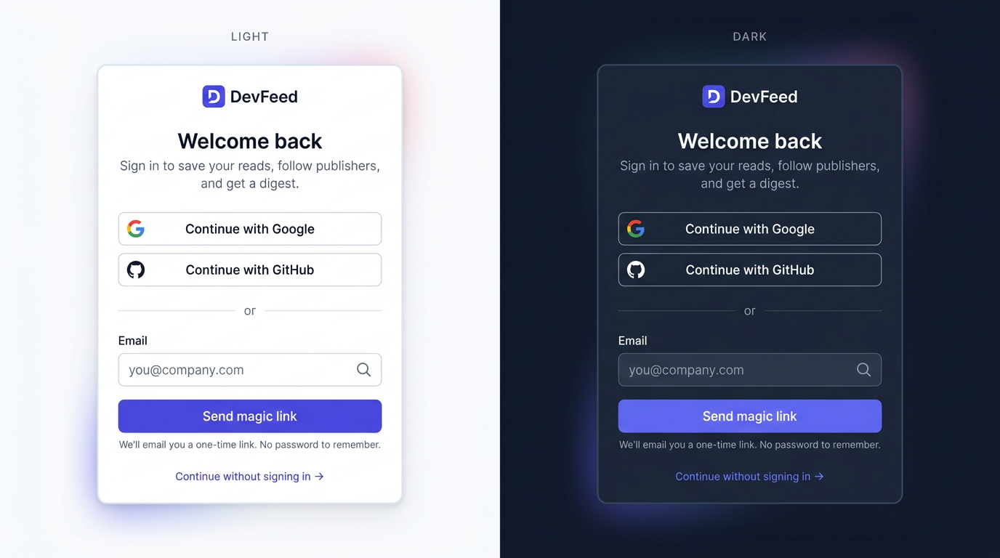

Email magic link primary, Google + GitHub OAuth above. No passwords. Both themes shown side-by-side as a parity check. "Continue without signing in" link at the bottom emphasizes the anonymous-first model.

---

## 07 — User dashboard / digest settings (dark)

**Path:** `/me/digest`  ·  **Spec:** [`design/03-pages.md → /me/digest`](design/03-pages.md#medigest--email-digest-preferences)

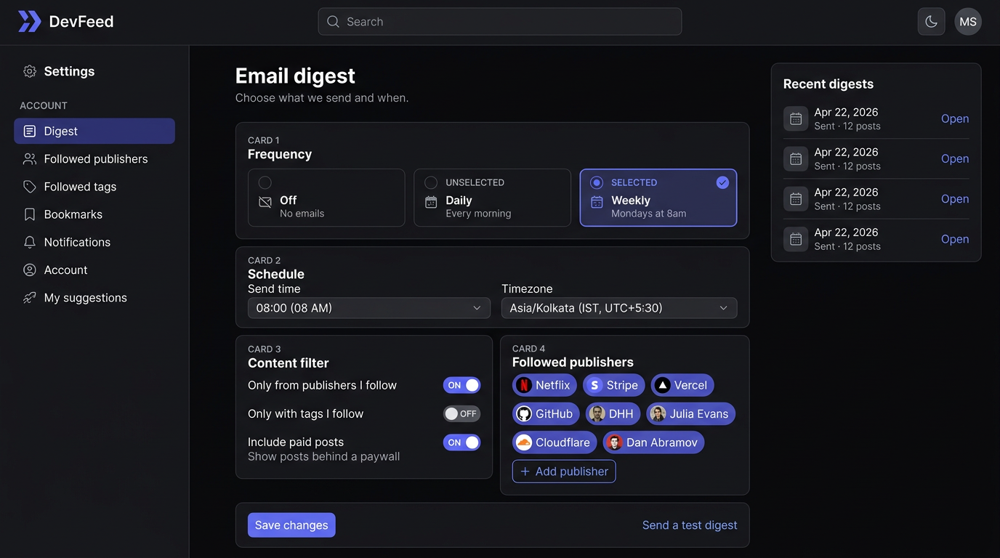

Settings sidebar nav, Frequency / Schedule / Content filter / Followed publishers cards, Recent digests log. Content filter is now exactly three switches: "Only from publishers I follow", "Only with tags I follow", "Include paid posts" — the AI-generated toggle was removed with the AI-agent scope cut.

---

## 08 — Email digest preview (rendered in inbox)

**Spec:** [`design/03-pages.md → /me/digest`](design/03-pages.md#medigest--email-digest-preferences)  ·  **Template:** `lib/email/digest.tsx`

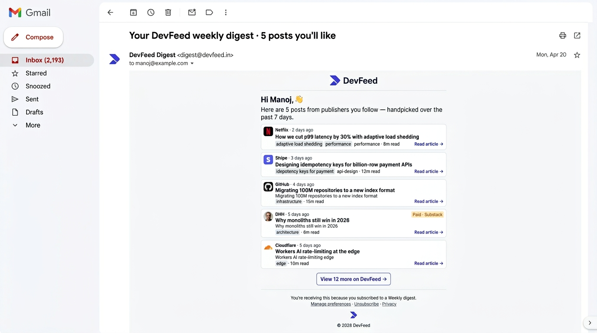

Mocked Gmail-style chrome at top, then the actual `react-email` body: greeting, 5-post list with publisher logos and (optional) Paid · Substack badge, "View N more on DevFeed" CTA, footer with manage-prefs and unsubscribe.

---

## 09 — Admin sources CRUD (dark)

**Path:** `/admin/sources`  ·  **Spec:** [`design/03-pages.md → /admin/sources`](design/03-pages.md#adminsources)

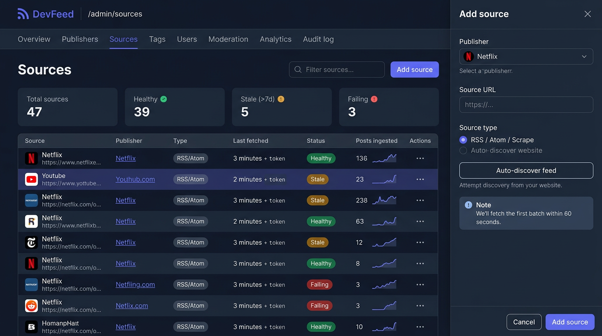

KPI strip, filterable data table with status pills + inline sparklines, partial side drawer for "Add source" form with auto-discover-feed CTA.

---

## 10 — Admin publishers grid (light)

**Path:** `/admin/publishers`  ·  **Spec:** [`design/03-pages.md → /admin/publishers`](design/03-pages.md#adminpublishers-replaces-admincompanies)

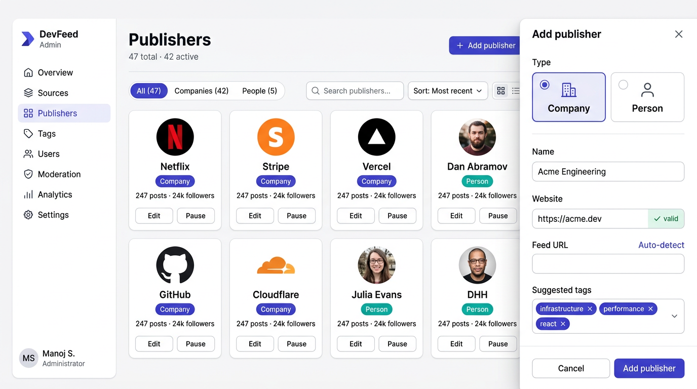

Grid of publisher cards (each with logo, type pill, stats), partial side drawer for "Add publisher" with the unified type selector (Company / Person — exactly two options) at the top. Filter row at top: All / Companies / People.

---

## 11 — Post detail modal (light)

**Trigger:** Click any `PostCard` title (anonymous or authed)  ·  **Spec:** [`design/03-pages.md → PostDetailModal`](design/03-pages.md)

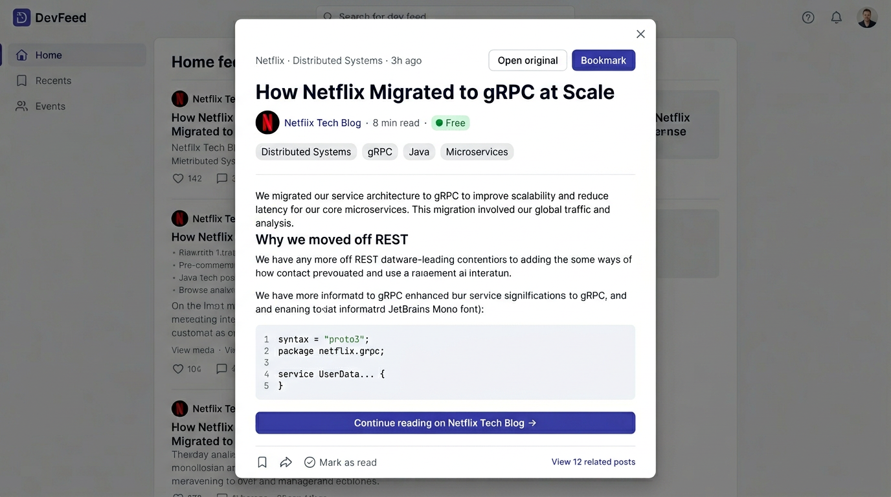

In-app preview modal so users get a fast taste of the post without an outbound roundtrip. Sticky header with breadcrumb + Open original / Bookmark actions; article preview body with code blocks; sticky footer with mark-as-read + related posts. The home feed behind is dimmed by a 40% scrim.

---

## 12 — Search (light)

**Paths:** typeahead in any nav · `/search?q=...` results page  ·  **Spec:** [`design/03-pages.md → /search`](design/03-pages.md#search--full-text-search)

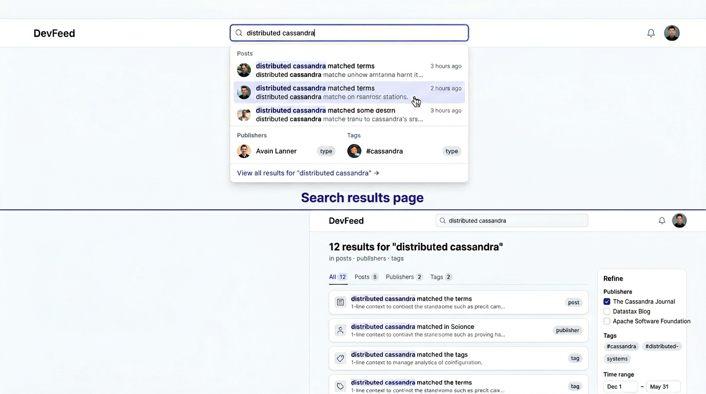

Top half: focused typeahead from the global nav with sectioned results (Posts / Publishers / Tags) and a "View all results" link. Bottom half: the dedicated `/search` results page with a sortable tab bar, refine sidebar, and rich result rows. Match terms highlighted in indigo.

---

## 13 — Bookmarks with grouping + bulk actions (dark)

**Path:** `/me/bookmarks`  ·  **Spec:** [`design/03-pages.md → /me/bookmarks`](design/03-pages.md#mebookmarks)

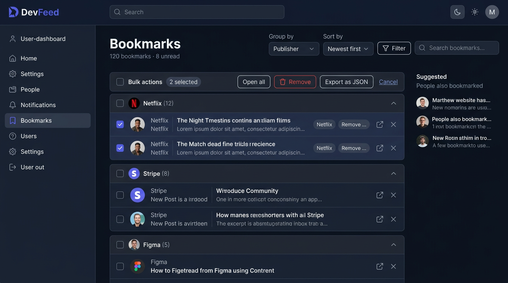

`Group by` (Publisher / Tag / Date / None) + `Sort by` controls. When 1+ rows are checked, a sticky bulk-actions toolbar appears: Open all / Remove / Export as JSON. Right sidebar shows "People also bookmarked" suggestions.

---

## 14 — Empty states (light + dark)

**Spec:** [`design/02-components.md → EmptyState`](design/02-components.md#emptystate)

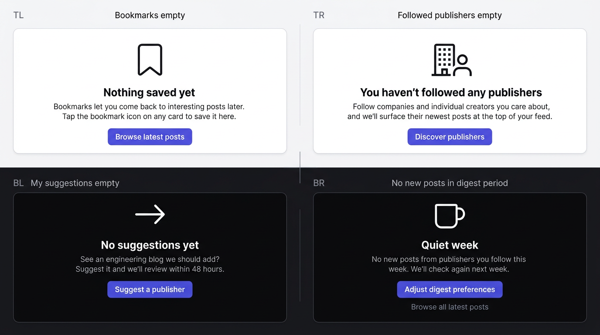

Four representative empty states across light + dark, each with: large outlined icon, headline, helpful subtitle (never blame the user), and a clear primary CTA back into a productive flow. Used by `/me/bookmarks`, `/me/followed-publishers`, `/me/suggestions`, and the "no new posts" digest period state. Subtitles reference only "companies and individual creators" — the AI-agent verbiage from the previous revision is gone.

---

## 15 — Onboarding (light)

**Path:** `/onboarding` (first sign-in only)  ·  **Spec:** [`design/03-pages.md → /onboarding`](design/03-pages.md#onboarding--first-sign-in-flow)  ·  **Flow:** [`design/04-flows.md → Onboarding`](design/04-flows.md)

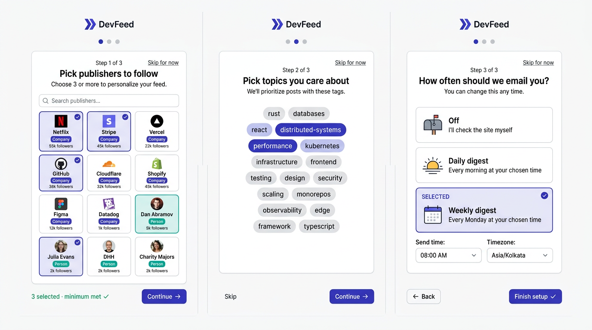

Three-step flow shown side-by-side: Step 1 picks publishers (a mix of company logos and person photos, each tagged with a Company or Person pill — no third type), Step 2 picks tags, Step 3 picks digest cadence + timezone. Skip-for-now is always available top-right; the step indicator is up top. Validation rules ("min 3 selected") are surfaced inline at the bottom.

---

## 16 — Error states (light)

**Paths:** `app/not-found.tsx`, `app/error.tsx`, `app/offline.tsx`  ·  **Spec:** [`design/03-pages.md → Error states`](design/03-pages.md)

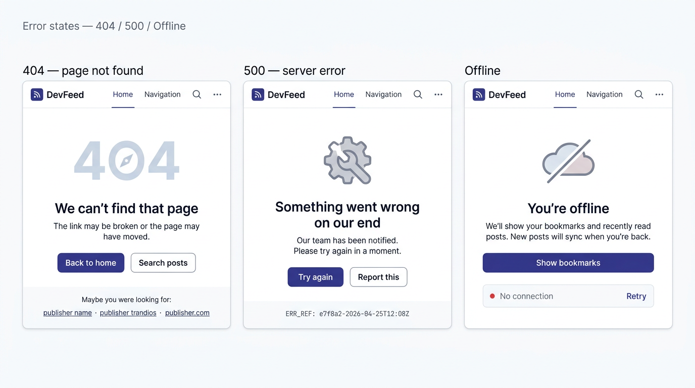

404 / 500 / Offline panels rendered inside the actual app shell so they don't feel like dead-ends. The 500 panel exposes a small `ERR_REF` token in JetBrains Mono for support correlation. The offline panel pivots the user to cached bookmarks.

---

## 17 — Loading skeletons (light + dark)

**Spec:** [`design/02-components.md → Skeleton`](design/02-components.md#skeleton)

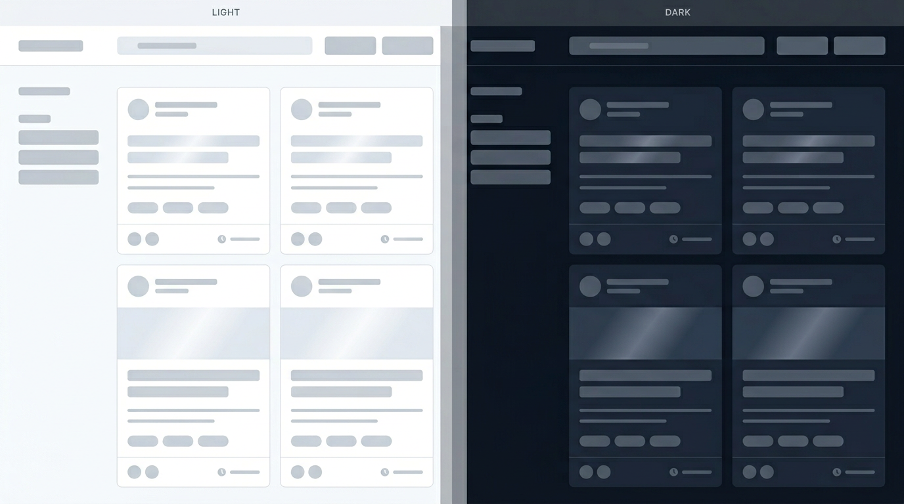

Skeleton mirrors the real `PostCard` layout (avatar dot, title bars, excerpt lines, chip rectangles, footer icons) with a subtle shimmer band. Light + dark side-by-side. Used on every list-fetching page to preserve perceived perf.

---

## 18 — Admin users (light)

**Path:** `/admin/users`  ·  **Spec:** [`design/03-pages.md → /admin/users`](design/03-pages.md#adminusers)

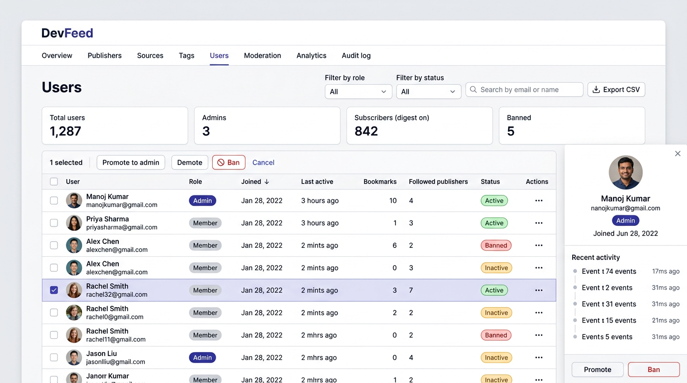

KPI strip, sortable users table with role / status pills, bulk-action toolbar when rows are selected (Promote / Demote / Ban), and a right-edge user-detail drawer showing recent activity. Banning is reversible within 30 days per the audit policy.

---

## 19 — Destructive confirmations (light)

**Spec:** [`design/02-components.md → ConfirmationModal`](design/02-components.md)

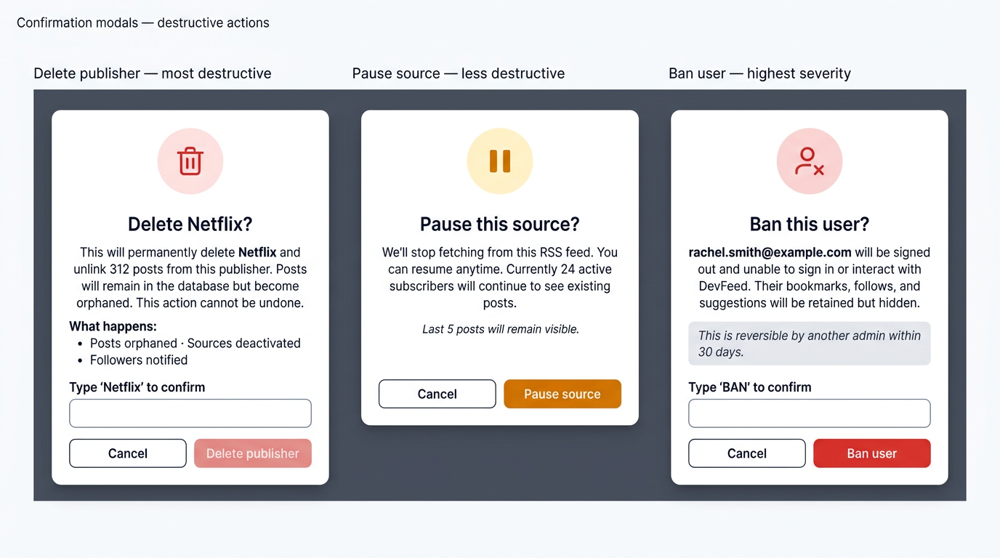

Three severity tiers shown together: Delete publisher (red, type-to-confirm), Pause source (amber, no type-to-confirm because it's reversible), Ban user (red, type-to-confirm "BAN"). Consequences are listed explicitly; reversibility is called out where relevant.

---

## 20 — Suggest publisher (light)

**Path:** `/suggest`  ·  **Spec:** [`design/03-pages.md → /suggest`](design/03-pages.md#suggest--suggest-a-publisher)  ·  **Flow:** [`design/04-flows.md → Suggestion`](design/04-flows.md)

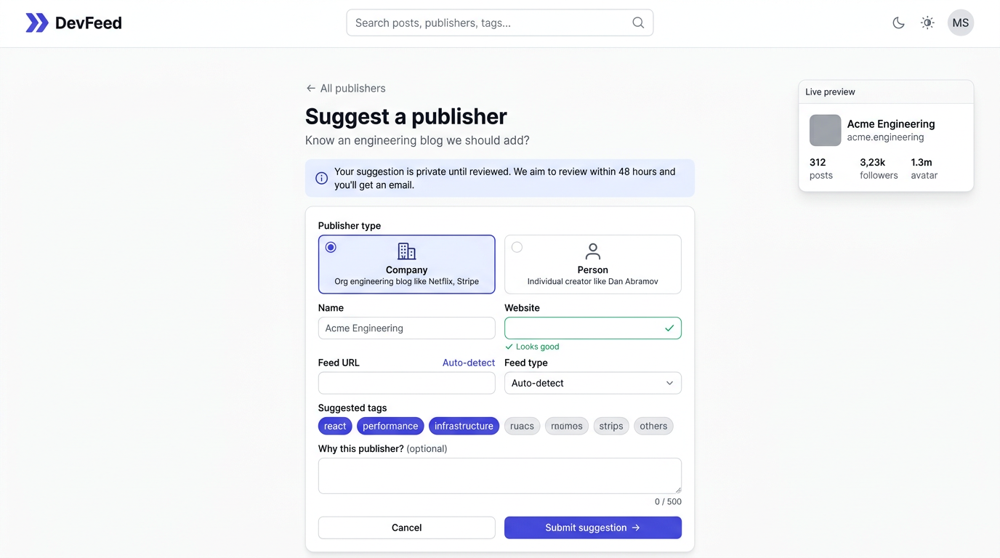

Two-tile publisher-type selector at the top (Company / Person — no third type since AI agents were removed from scope). Form fields below adapt to the chosen type — this view shows the Company variant with auto-discover-feed CTA and a live preview card on the right.

---

## 21 — Admin moderation queue (dark)

**Path:** `/admin/moderation`  ·  **Spec:** [`design/03-pages.md → /admin/moderation`](design/03-pages.md#adminmoderation)  ·  **Flow:** [`design/04-flows.md → Admin reviews`](design/04-flows.md)

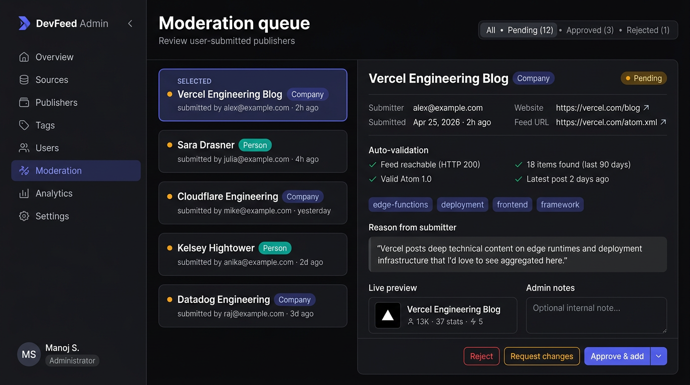

Filter row by status (All / Pending / Approved / Rejected). Two-pane layout: left list of pending suggestions, right detail pane showing all submitted fields plus an explicit auto-validation checklist (feed reachable, valid Atom/RSS, items found, latest post age). Type badges are limited to Company (indigo) or Person (teal). Sticky footer with Reject / Request changes / Approve & add.

---

## 22 — Person publisher profile (light)

**Path:** `/publishers/julia-evans`  ·  **Spec:** [`design/03-pages.md → /publishers/[slug] (person variant)`](design/03-pages.md#publishersslug--publisher-detail)

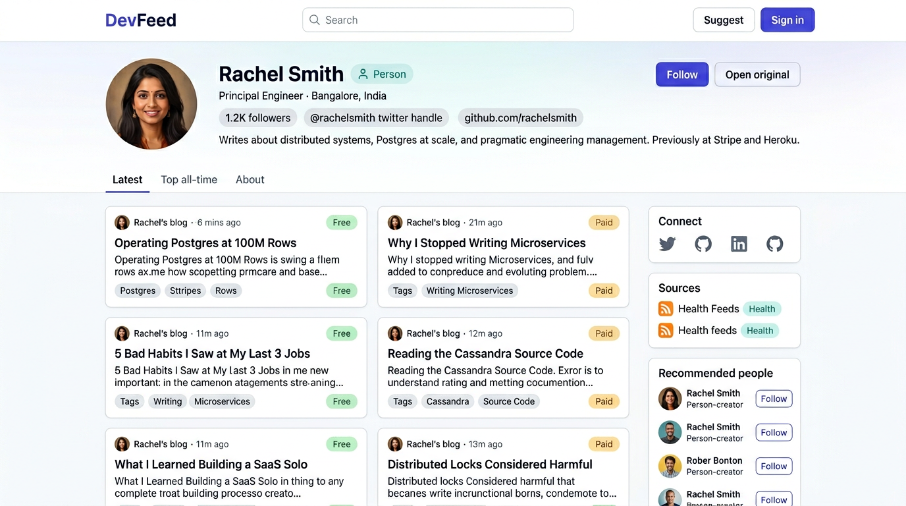

`PublisherHeader` person variant: large headshot avatar (no logo), Person pill in teal, role + location subline, social handles chip row. Posts can mix Free + Paid badges (individual creators commonly run a partial paywall). Right sidebar surfaces social links and recommended people instead of "related publishers".

---

## 24 — Home with publisher-type filter (light)

**Path:** `/?type=person`  ·  **Spec:** [`design/03-pages.md → /`](design/03-pages.md#---home-feed)

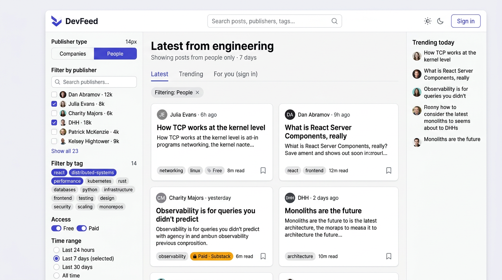

Same home shell as #01 but with the publisher-type segmented control as the focal element — currently filtering by People only. The filter sidebar shows just two type pills (Companies / People), and the main feed surfaces only person publishers (Julia Evans, Dan Abramov, Charity Majors, DHH). Demonstrates the URL-driven filter (`?type=person`) in action.
