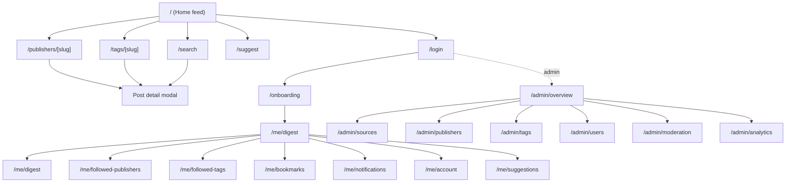

# 00 — Product & Design Overview

## Product in one sentence

**DevFeed is a free, ad-free aggregator that pulls engineering posts from companies and individual creators into a single, filterable, subscribe-able feed — so engineers stop tab-juggling 40 RSS readers.**

## Audience

| Persona               | What they want                                                                       | Primary screens                          |
| --------------------- | ------------------------------------------------------------------------------------ | ---------------------------------------- |
| Curious engineer      | Skim the latest from companies they admire. Bookmark for later. Read on their phone. | Home feed, Publisher detail, Bookmarks   |
| Job seeker            | Read the engineering blog of every company they're interviewing at, in one place.    | Publisher detail, Tag detail             |
| Senior IC / staff     | Follow specific authors instead of company firehoses. Read on a schedule, not a feed.| Person profiles, Email digest            |
| DevFeed admin (Manoj) | Curate the catalog, moderate user submissions, watch trends, prune dead feeds.       | Admin overview, Moderation, Analytics    |

## Brand foundation

- **Name (working):** DevFeed
- **Wordmark:** "DevFeed" in Inter Bold, paired with a small chevron / RSS-style glyph in indigo
- **Voice:** direct, low-ceremony, slightly nerdy. Never marketing-y. Examples: *"Nothing saved yet"* (not *"Looks like your bookmarks are empty!"*), *"You're offline"* (not *"Whoops!"*).
- **Positioning:** "Engineering blogs, in one place." That's it. No infinite scroll, no algorithmic outrage, no ads.

## Design philosophy (5 principles)

1. **Content is the UI.** Cards are quiet. Chrome is quiet. The post title gets the visual weight.
2. **Density that respects the reader.** 24px card padding, 16px gap. Not Twitter-tight, not Medium-loose.
3. **Light AND dark, equally cared-for.** Dark is not an afterthought. Both themes get the same review pass.
4. **Anonymous-first, sign-in is optional.** Every public surface works without an account. Auth gates are reserved for personal state (bookmarks, follows, digest).
5. **Predictable, keyboard-first.** Every interactive element reachable by tab. `/` focuses search. `b` bookmarks the focused card. No mystery interactions.

## Information architecture

## Publisher model (locked)

A single `publishers` table with a `type` enum:

- **company** — orgs like Netflix, Stripe. Logo prominent (square rounded avatar). "Followers" stat.
- **person** — individual creators like Dan Abramov, Julia Evans. Round avatar. Social handles. "Posts published".

Posts inherit a `publisher_id`. Posts also carry an `access_label` (`free | paid | members_only | mixed`) and a `paywall_provider` (Substack/Ghost/Medium/Patreon/etc.) — surfaced as a small badge on the card. We never paywall on our side; paid is label-only.

## Mockup index

All 23 mockups live in [`../assets/`](../assets) (relative to this file) and are embedded inline in [`../MOCKUPS.md`](../MOCKUPS.md). Open `MOCKUPS.md` in Cursor's Markdown Preview to view them.

| #  | File                                          | What it shows                                       | Theme |
| -- | --------------------------------------------- | --------------------------------------------------- | ----- |
| 01 | `assets/devfeed-01-home-light.png`            | Public home feed                                    | Light |
| 02 | `assets/devfeed-02-home-dark.png`             | Public home feed (theme parity)                     | Dark  |
| 03 | `assets/devfeed-03-admin-analytics-light.png` | Admin analytics dashboard                           | Light |
| 04 | `assets/devfeed-04-company-page-light.png`    | Publisher detail (company variant)                  | Light |
| 05 | `assets/devfeed-05-tag-page-dark.png`         | Tag detail with related-tags                        | Dark  |
| 06 | `assets/devfeed-06-login-both-themes.png`     | Login with magic link + Google + GitHub             | Both  |
| 07 | `assets/devfeed-07-user-dashboard-dark.png`   | `/me/digest` settings                               | Dark  |
| 08 | `assets/devfeed-08-email-digest-preview.png`  | Email digest as rendered in Gmail inbox             | Light |
| 09 | `assets/devfeed-09-admin-sources-dark.png`    | Admin sources CRUD with side drawer                 | Dark  |
| 10 | `assets/devfeed-10-admin-companies-light.png` | Admin publishers grid + Add-publisher drawer        | Light |
| 11 | `assets/devfeed-11-post-detail-modal-light.png` | Post preview modal over dimmed feed              | Light |
| 12 | `assets/devfeed-12-search-light.png`          | Typeahead + dedicated `/search`                     | Light |
| 13 | `assets/devfeed-13-bookmarks-dark.png`        | Bookmarks with grouping + bulk actions              | Dark  |
| 14 | `assets/devfeed-14-empty-states.png`          | 4-up empty-state sheet                              | Both  |
| 15 | `assets/devfeed-15-onboarding-light.png`      | 3-step onboarding                                   | Light |
| 16 | `assets/devfeed-16-error-states.png`          | 404 / 500 / offline                                 | Light |
| 17 | `assets/devfeed-17-loading-skeletons.png`     | Skeleton loading state                              | Both  |
| 18 | `assets/devfeed-18-admin-users-light.png`     | Admin users table + detail drawer                   | Light |
| 19 | `assets/devfeed-19-confirmation-modals.png`   | 3 destructive-action confirms                       | Light |
| 20 | `assets/devfeed-20-suggest-publisher-light.png` | Suggest form with Company/Person selector         | Light |
| 21 | `assets/devfeed-21-admin-moderation-dark.png` | Admin moderation queue with detail pane             | Dark  |
| 22 | `assets/devfeed-22-publisher-person-light.png` | Person publisher profile                           | Light |
| 24 | `assets/devfeed-24-home-with-typefilter.png`  | Home with publisher-type filter (`?type=person`)    | Light |

> Mockup #23 (a previous "AI agent publisher profile") was deleted on 2026-04-25 when the AI-agent publisher type was removed from product scope. The remaining numbering is intentionally non-contiguous to avoid renaming churn.

## Conventions used in this spec

- **MUST** / **SHOULD** / **MAY** follow [RFC 2119](https://www.rfc-editor.org/rfc/rfc2119) — "MUST" is non-negotiable; "SHOULD" can be skipped with justification.
- File paths are clickable when this is rendered in Cursor.
- Tokens are referenced as `--df-bg`, `--df-text-primary`, etc. (see [`01-tokens.md`](01-tokens.md)).
- Components are referenced in `PascalCase` (e.g. `PostCard`, `PublisherHeader`).
