# 04 — User & System Flows

> All major flows as mermaid diagrams + step descriptions. These are the source of truth for behavior — if a screen disagrees with a flow, the flow wins until updated.

## Flow index

1. [Anonymous browsing → read a post](#anonymous-browsing--read-a-post)
2. [Sign in via email magic link](#sign-in-via-email-magic-link)
3. [Sign in via Google OAuth](#sign-in-via-google-oauth)
4. [First-time onboarding](#first-time-onboarding)
5. [Bookmark a post (anonymous → forced sign-in)](#bookmark-gating)
6. [Follow a publisher](#follow-a-publisher)
7. [Subscribe to digest](#subscribe-to-digest)
8. [Suggest a publisher (NEW)](#suggest-a-publisher)
9. [Admin reviews suggestion (NEW)](#admin-reviews-suggestion)
10. [Daily / weekly digest send](#daily--weekly-digest-send)
11. [Ingestion pipeline (RSS + scrape + access detection)](#ingestion-pipeline)
12. [Read-event tracking with anonymous_id](#read-event-tracking)
13. [System architecture (recap)](#system-architecture-recap)

---

## Anonymous browsing → read a post

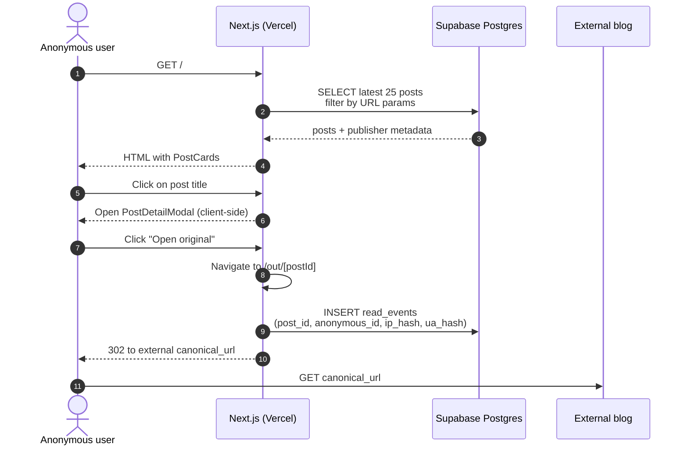

**Notes:**
- The `anonymous_id` is a first-party cookie (`df_anon`) set on first visit; survives across sessions, never expires.
- IP and UA are hashed using `HMAC-SHA256(value, daily_rotating_salt)` — original values never persisted.
- If JS disabled, post titles link directly to `/out/[postId]` instead of opening the modal — read tracking still works.

---

## Sign in via email magic link

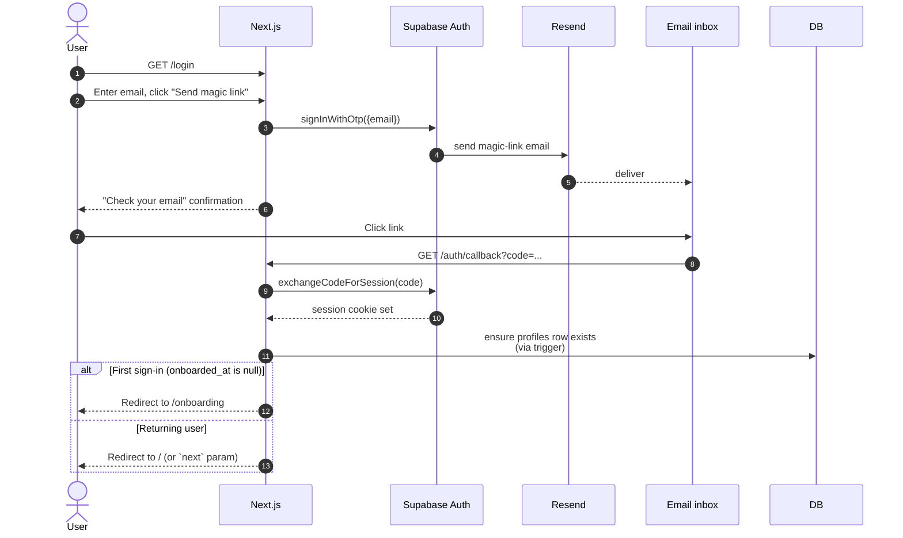

---

## Sign in via Google OAuth

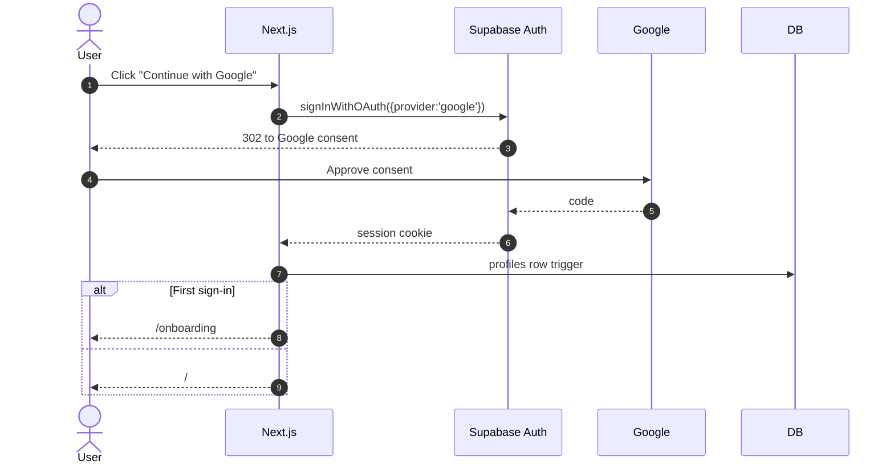

---

## First-time onboarding

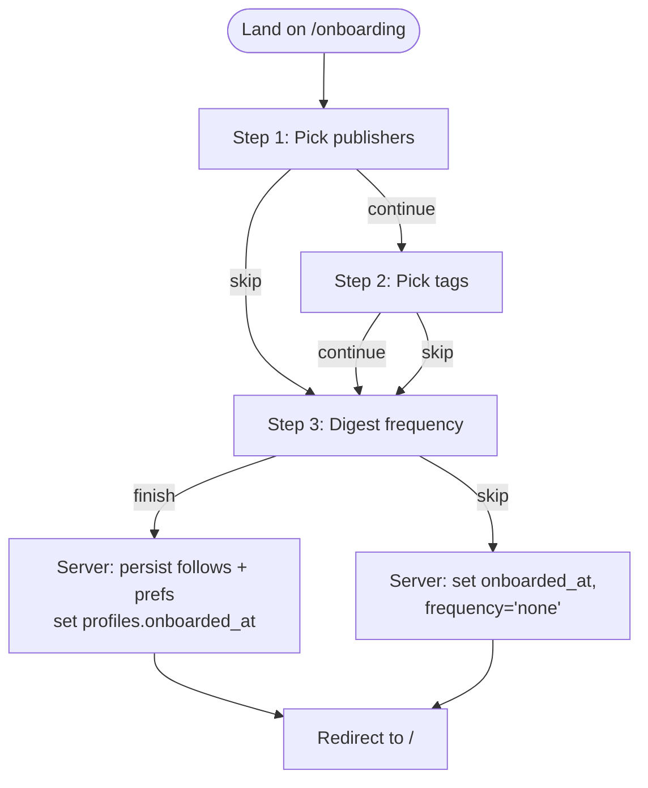

State is persisted at each step (so user can leave and return). Re-entering `/onboarding` after `onboarded_at` is set redirects to `/me/digest` instead.

---

## Bookmark gating

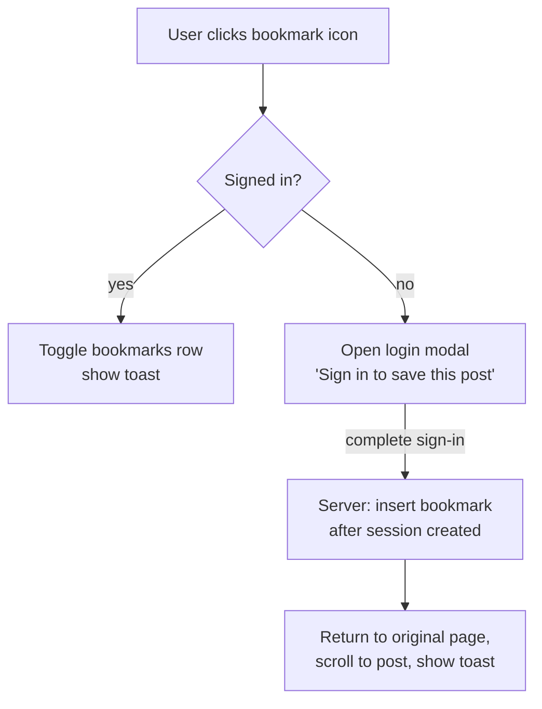

Same pattern for Follow buttons. The `next` query param carries the original URL through the OAuth round-trip.

---

## Follow a publisher

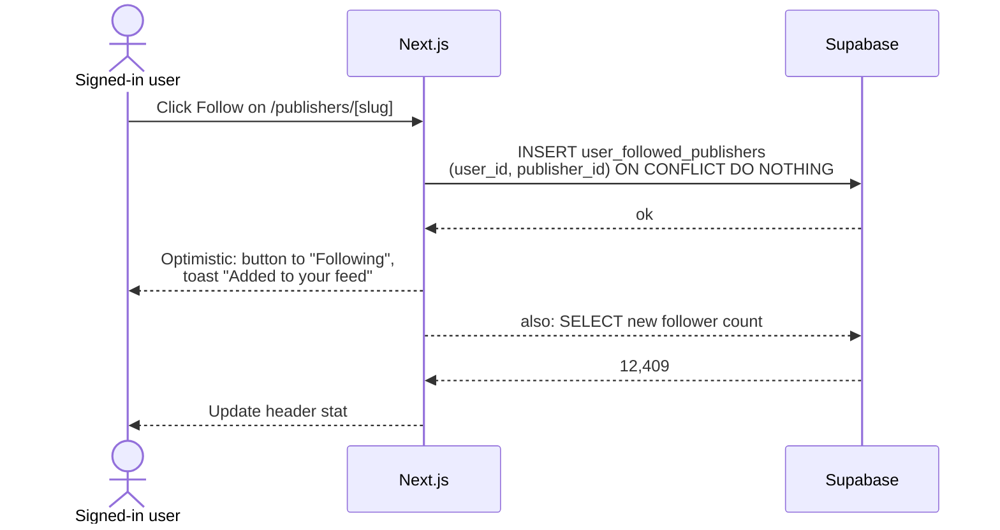

Unfollow uses the inverse with a confirmation toast that includes Undo (5s window).

---

## Subscribe to digest

```mermaid
flowchart TD
  Visit[/me/digest] --> Edit[User changes frequency or filter toggle]
  Edit --> Save{Click Save changes}
  Save --> Persist[Server Action: update digest_preferences]
  Persist --> Toast[Toast 'Saved' + show next-send time]
  
  Test[Click 'Send a test digest'] --> Render[Server: render react-email template<br/>with last 5 posts matching prefs]
  Render --> Resend[POST to Resend API]
  Resend --> Inbox[Test email arrives within ~10s]
```

Frequency=`none` disables sends entirely; the daily/weekly cron skips that user.

---

## Suggest a publisher

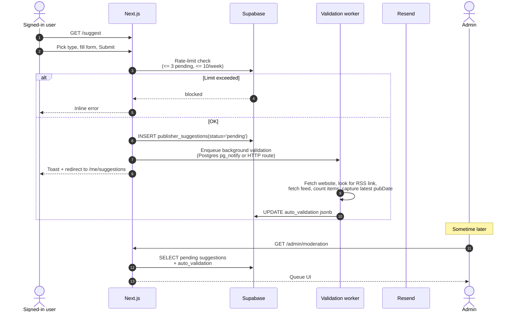

---

## Admin reviews suggestion

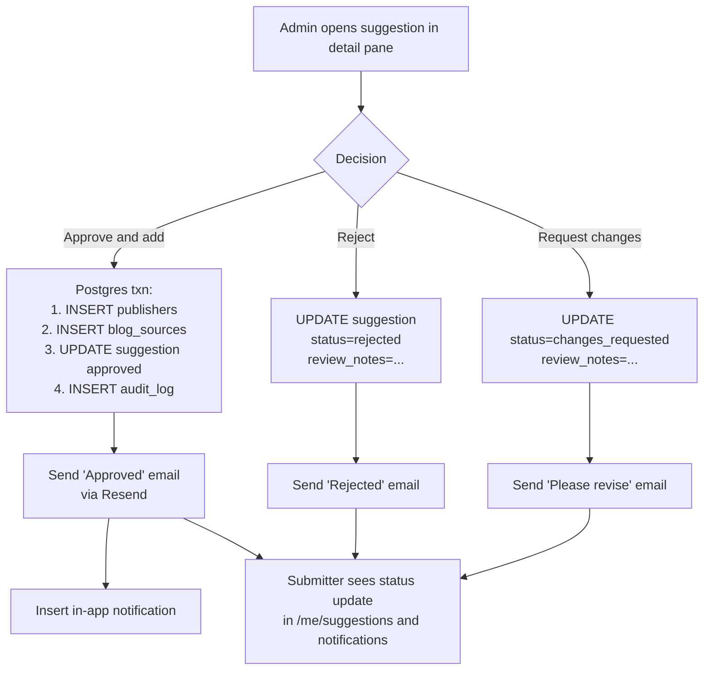

The Postgres transaction in Approve guarantees we never end up with a publisher row but no source (or vice versa). All three decisions write to `audit_log` for traceability.

---

## Daily / weekly digest send

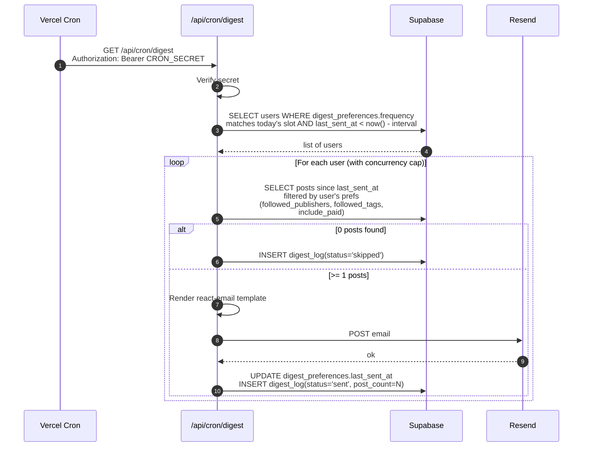

**Throttling:** Resend free tier is 100/day. If user count > 100, the daily cron stages sends across the day in batches of ~80 to leave headroom.

**Unsubscribe:** Each email contains an `Unsubscribe` link → `/api/digest/unsubscribe?token=...` (signed JWT) → sets `frequency='none'` and shows a "You're unsubscribed" page with a re-enable button.

---

## Ingestion pipeline

```mermaid
flowchart LR
  Cron[Vercel Cron every 4h] --> Auth[Verify CRON_SECRET]
  Auth --> Load["SELECT active sources<br/>WHERE last_fetched_at < now()-1h"]
  Load --> Pool{Type?}
  Pool -- "rss/atom" --> Rss[rss-parser fetch + parse]
  Pool -- "scrape" --> Scr["Cheerio: find article links<br/>via scrape_config.selector"]
  Scr --> Read[Mozilla Readability<br/>extract title/summary/date]
  Rss --> Canon[Canonicalize URL<br/>strip UTM/gclid/hash]
  Read --> Canon
  Canon --> Detect["detectAccess.ts:<br/>infer paywall from RSS hints<br/>or known paywall_provider"]
  Detect --> Tag["autoTag.ts:<br/>match title+summary against<br/>tag dictionary"]
  Tag --> Dedupe{canonical_url<br/>already exists?}
  Dedupe -- yes --> Skip[skip]
  Dedupe -- no --> Insert[INSERT posts + post_tags]
  Insert --> Update[UPDATE blog_sources.last_fetched_at]
  Update --> Log["Structured JSON log:<br/>source_id, inserted, errors"]
```

**SSRF guard (mandatory):** Before any feed fetch, resolve hostname and reject if it resolves to a private/loopback/link-local range. Allow only `http(s)` schemes.

**Paid detection:** `detectAccess.ts` heuristics:

- Substack feeds expose `<enclosure type="text/html"/>` for paid posts in some configurations.
- Ghost feeds set the `<itunes:summary>` to a "members-only" string.
- Medium hides paid post bodies under `<content:encoded>` ending in "Continue reading on Medium".
- We default to `free` and only flag `paid`/`members_only` when a heuristic matches. Admin can override per source via `default_access_label`.

---

## Read-event tracking

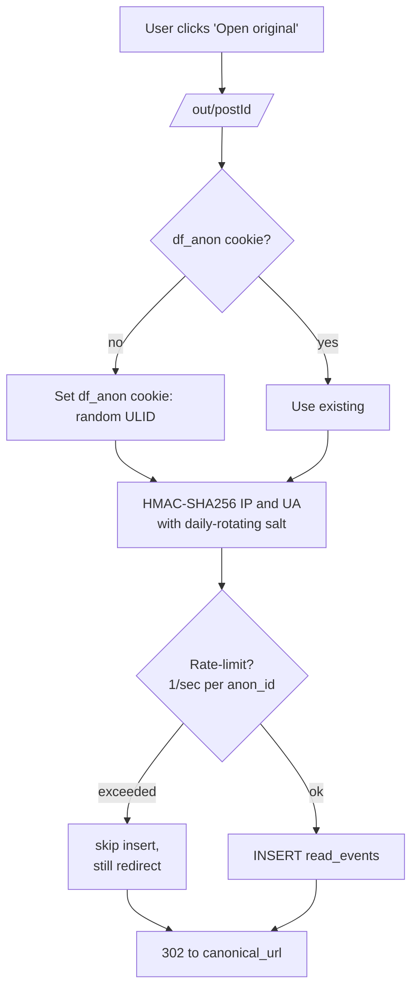

The `read_events` table is partitioned monthly. After 90 days, raw rows are aggregated into `read_events_daily` (post_id, day, count) and the raw partition is dropped. This keeps the DB under 500MB on free tier.

---

## System architecture (recap)

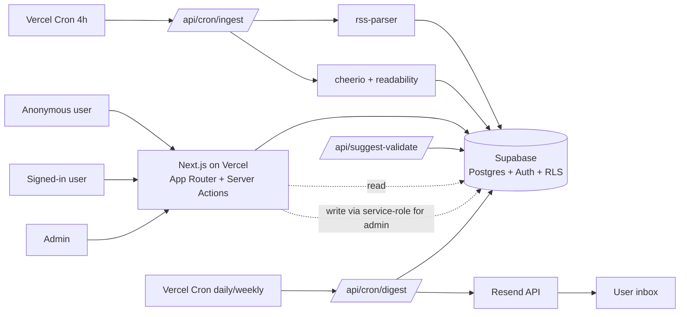
