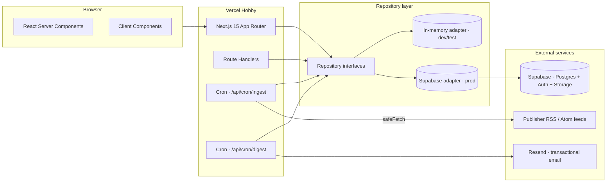

# System architecture

A bird's-eye view of how the runtime pieces fit together.

Key contracts:

- **Repository pattern** isolates business logic from storage. Tests + dev use the in-memory adapter; production uses the Supabase adapter.
- **Auth** is a separate adapter (`stub` for dev, `supabase` for prod) so the rest of the app never touches `@supabase/ssr` directly.
- **Email** is also adapter-shaped (`console` for dev, `resend` for prod).
- **Cron jobs** are plain Route Handlers gated by `Authorization: Bearer $CRON_SECRET`.
