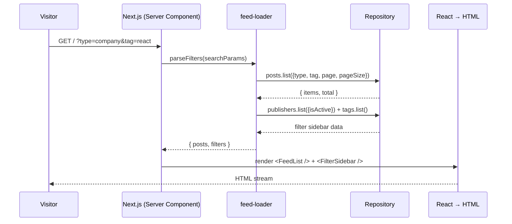
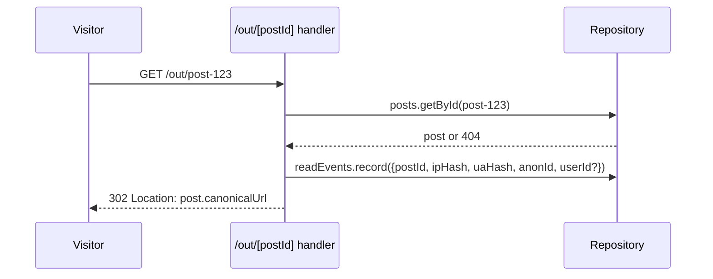

# Public feed flow

How a request to `/` is served to an anonymous reader.

```mermaid
sequenceDiagram
  participant U as Visitor
  participant N as Next.js (Server Component)
  participant L as feed-loader
  participant R as Repository
  participant V as React → HTML

  U->>N: GET / ?type=company&tag=react
  N->>L: parseFilters(searchParams)
  L->>R: posts.list({type, tag, page, pageSize})
  R-->>L: { items, total }
  L->>R: publishers.list({isActive}) + tags.list()
  R-->>L: filter sidebar data
  L-->>N: { posts, filters }
  N->>V: render <FeedList /> + <FilterSidebar />
  V-->>U: HTML stream
```

Read-tracking is performed when the visitor clicks a post:

```mermaid
sequenceDiagram
  participant U as Visitor
  participant H as /out/[postId] handler
  participant R as Repository

  U->>H: GET /out/post-123
  H->>R: posts.getById(post-123)
  R-->>H: post or 404
  H->>R: readEvents.record({postId, ipHash, uaHash, anonId, userId?})
  H-->>U: 302 Location: post.canonicalUrl
```
