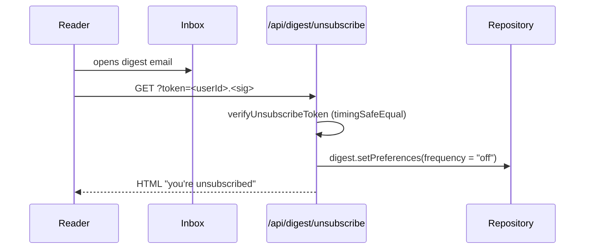

# Digest pipeline

Hourly cron (`/api/cron/digest`) sends digests to users whose
`preferredHourUtc` equals the current hour and who haven't received
one in their cadence window.

```mermaid
flowchart TD
  CRON([Cron · /api/cron/digest]) --> AUTH{Bearer auth?}
  AUTH -- no --> R401[401]
  AUTH -- yes --> SCAN[digest.usersDueAt now]

  SCAN --> LOOP{per user}
  LOOP --> CAND[posts.list since lastSentAt]
  CAND --> SELECT[selectDigestPosts · access labels + follows + cap]
  SELECT --> EMPTY{posts > 0?}
  EMPTY -- no --> SKIP[skipped++]
  EMPTY -- yes --> RENDER[renderDigestEmail]
  RENDER --> TOKEN[createUnsubscribeToken HMAC]
  TOKEN --> SEND[email.send]
  SEND -- ok --> MARK[digest.markSent userId]
  SEND -- fail --> FAIL[failed++]

  LOOP --> SUMMARY[return { sent, skipped, failed }]
```

Unsubscribe round-trip:


