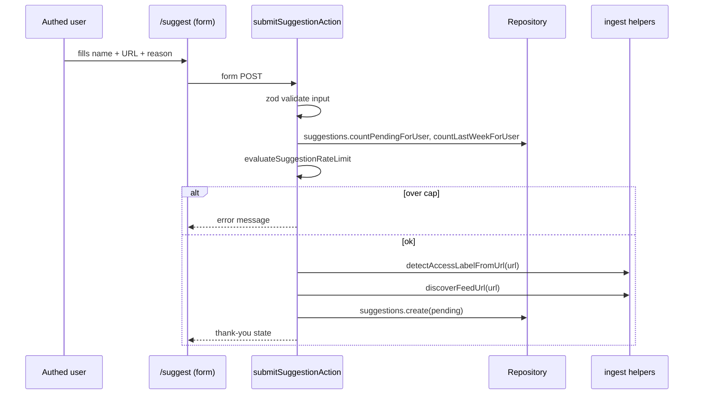
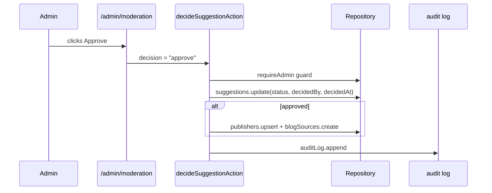

# Suggest publisher flow

Users propose a new company or person blog; admins approve, reject, or
request changes.

```mermaid
sequenceDiagram
  participant U as Authed user
  participant F as /suggest (form)
  participant SA as submitSuggestionAction
  participant R as Repository
  participant ING as ingest helpers

  U->>F: fills name + URL + reason
  F->>SA: form POST
  SA->>SA: zod validate input
  SA->>R: suggestions.countPendingForUser, countLastWeekForUser
  SA->>SA: evaluateSuggestionRateLimit
  alt over cap
    SA-->>F: error message
  else ok
    SA->>ING: detectAccessLabelFromUrl(url)
    SA->>ING: discoverFeedUrl(url)
    SA->>R: suggestions.create(pending)
    SA-->>F: thank-you state
  end
```

Admin moderation:

```mermaid
sequenceDiagram
  participant A as Admin
  participant M as /admin/moderation
  participant DA as decideSuggestionAction
  participant R as Repository
  participant AUD as audit log

  A->>M: clicks Approve
  M->>DA: decision = "approve"
  DA->>R: requireAdmin guard
  DA->>R: suggestions.update(status, decidedBy, decidedAt)
  alt approved
    DA->>R: publishers.upsert + blogSources.create
  end
  DA->>AUD: auditLog.append
```
